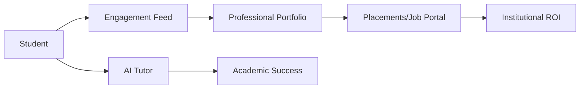

# Detailed Comparison Report: SCMS vs. Global Alternatives

This document provides a feature-by-feature breakdown comparing **Smart Campus Management System (SCMS)** with industry benchmarks.

---

## 1. Functional Feature Matrix

| Feature | SCMS | Fedena (OSS) | OpenEduCat (ERP) | Canvas (LMS) |
| :--- | :---: | :---: | :---: | :---: |
| **Social Networking** | ✅ High | ❌ None | ❌ None | ⚠️ Low |
| **AI Academic Help** | ✅ Built-in | ❌ None | ❌ None | ⚠️ Add-on |
| **Direct Placement** | ✅ Advanced | ❌ Module | ✅ ERP | ❌ External |
| **Real-time Analytics** | ✅ Included | ⚠️ Basic | ✅ Deep | ✅ High |
| **Theme Customization** | ✅ Premium | ❌ Limited | ❌ Complex | ✅ High |

---

## 2. Architectural Comparison

### SCMS (MERN Architecture)
- **Flow**: Asynchronous, Real-time update via React.
- **Database**: NoSQL (Flexible), fast retrieval of unstructured post data.
- **Best For**: Student interaction and rapid deployment.

### OpenEduCat (Odoo/Python)
- **Flow**: Synchronous ERP flow.
- **Database**: PostgreSQL (Strict Relational).
- **Best For**: University accounting and massive HR payroll systems.

---

## 3. Visual System Flow (SCMS)

## 4. Why SCMS Wins
SCMS wins by offering **Unified Context**. While Canvas is just for "courses" and Fedena is just for "attendance", SCMS is for the **Student's Entire Professional Lifecycle** in the campus.

---
*Strategic Analysis Report - February 2026.*
