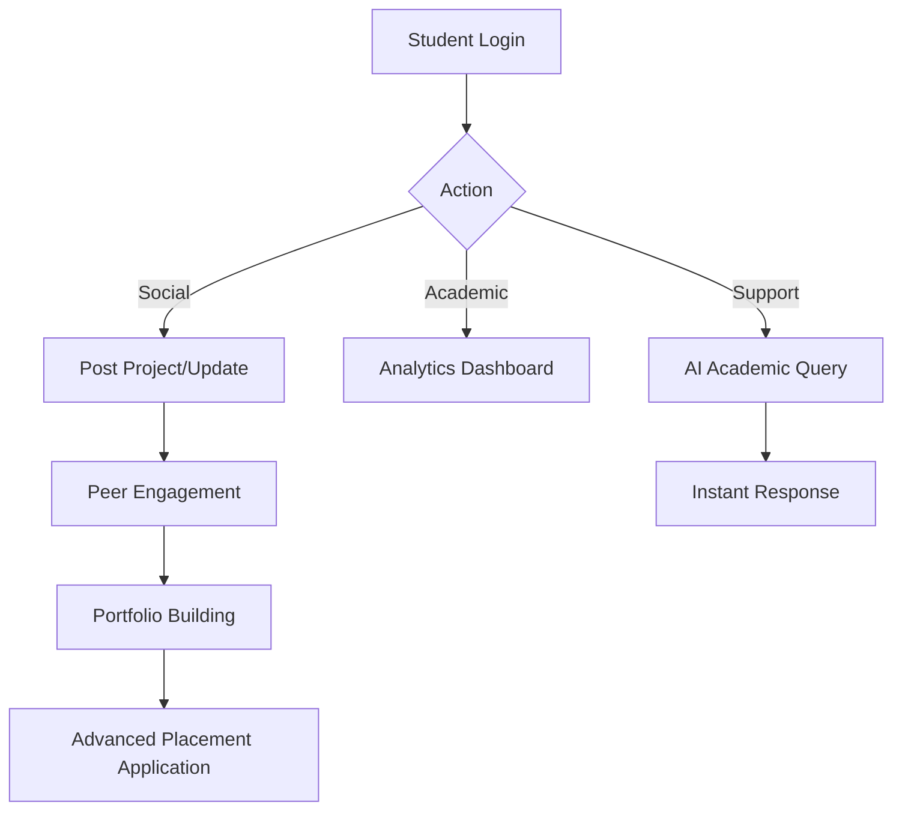

# Comprehensive System & Research Report: Smart Campus Management System

**Project Title:** Smart Campus Management System (Enterprise MERN Application)  
**Status:** Feature Complete / Production Ready  
**Report Date:** February 20, 2026  

---

## 1. Executive Summary
This document serves as the master report for the **Smart Campus Management System (SCMS)**. It encompasses system architecture, technical research, competitive analysis, and detailed functional workflows. SCMS is designed to bridge the gap between administrative utility and student engagement through modern full-stack technologies and integrated AI assistance.

## 2. Technical Architecture (MERN Stack)
The system utilizes a decoupled architecture for maximum performance and scalability:
- **Frontend**: React 18, Vite, Tailwind CSS, Framer Motion (Animations).
- **Backend**: Node.js, Express.js, JWT (HTTP-only cookies).
- **Database**: MongoDB Atlas (NoSQL).
- **Security**: Bcrypt password hashing, Helmet security headers, Role-Based Access Control (RBAC).

## 3. Academic Research & Methodology
### 3.1 Abstract
The SCMS project demonstrates the effectiveness of the MERN stack in creating high-performance institutional software. By implementing RBAC and an "AI-First" support layer, the platform reduces administrative lag and improves student academic outcomes.

### 3.2 Methodology
- **Asynchronous Data Handling**: Utilizing Node.js non-blocking I/O for real-time global announcements.
- **Dynamic Schema Design**: Use of MongoDB allows for flexible expansion of Placement and Scholarship criteria without legacy SQL constraints.
- **Identity Protection**: Stateless JWT authentication ensures secure cross-origin communication between the frontend and backend.

## 4. Feature Matrix (Global Comparison)

| Category | SCMS (Current Project) | Fedena | OpenEduCat (ERP) | Canvas / PowerSchool |
| :--- | :--- | :---: | :---: | :---: |
| **Social** | ✅ (Full Social Feed) | ❌ | ❌ | ❌ |
| **AI Support** | ✅ (Neural Assistant) | ❌ | ❌ | ⚠️ |
| **Career** | ✅ (Advanced Placement) | ❌ | ✅ | ❌ |
| **UX Design** | ✅ (Royal Aurora) | ❌ | ❌ | ✅ |
| **Auth** | ✅ (Google + JWT) | ❌ | ❌ | ✅ |

## 5. System Workflows

### 5.1 Student Engagement & Career Flow

## 6. Competitive Positioning
Unlike traditional systems like **Fedena** (Admin-centric) or **OpenEduCat** (Accounting-centric), **SCMS** is **Student-Centric**. It treats the campus as an ecosystem where data (attendance/grades) facilitates community (social posts) and career growth (placements).

## 7. Conclusion
The Smart Campus Management System represents a significant advancement in educational institutional software. Its modern architecture and focus on the student experience make it a superior alternative to legacy ERP solutions.

---
*End of Report.*
